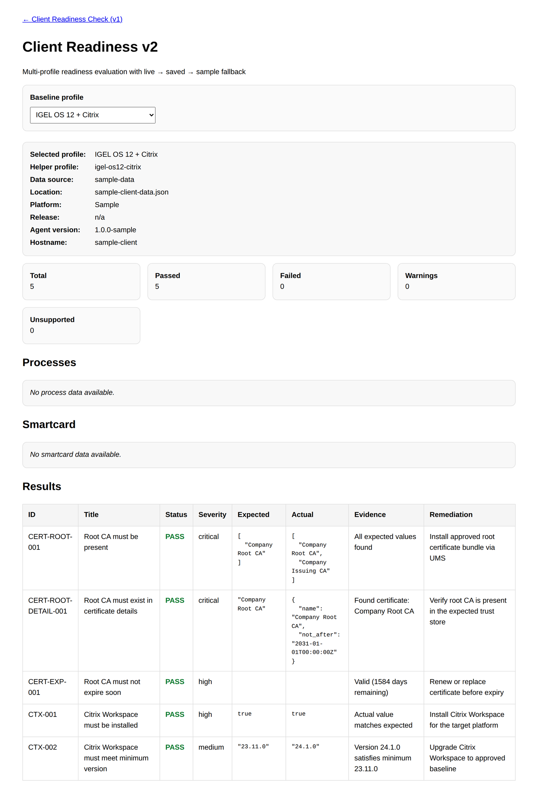

# Mattias Camner

### Infrastructure / Endpoint / Automation Architect

**Endpoint readiness · Repo intelligence · Governed AI operations**

I build reviewable tools for endpoint readiness, repository intelligence, and governed local AI operations.

[Run readiness tools](https://mcamner.github.io/MCamner/) ·
[Journal](https://mcamner.github.io/mcamner-journal/) ·
[LinkedIn](https://www.linkedin.com/in/mattias-camner-75958022) ·
[Black Iris](https://blackiris.se/)

## Start here

| I need endpoint readiness | I want to understand the MQ architecture |
|---|---|
| **[Run the browser check](https://mcamner.github.io/MCamner/client-readiness-check.html)** for a fast, browser-visible validation. | **[Follow the operating model](docs/OPERATING_MODEL.md)** from signal and score to policy gate and reusable memory. |
| **[Open Diagnostics v2](https://mcamner.github.io/MCamner/client-readiness-v2.html)** for profile-based evaluation and helper-enriched evidence. | **[Explore `macos-scripts`](https://github.com/MCamner/macos-scripts)** as the terminal entrypoint to the stack. |

## Client readiness in practice

The public demo evaluates endpoint signals against explicit profiles, shows the evidence behind every result, and provides remediation suitable for review by support or operations.

### Browser check or local helper?

| Mode | What it can inspect | Best for |
|---|---|---|
| Browser-only | Browser, secure context, display, locale, timezone, and basic endpoint reachability | Fast first-line validation with no installation |
| Browser + read-only helper | OS, network, certificates, smartcard, Citrix, management signals, and named baselines | Deeper diagnostics and repeatable operational evidence |

The page automatically falls back to browser-only checks when the helper is unavailable. See the [helper setup and deployment guide](helper/README.md) for the standard-library-only local agent.

## What I build

The MQ stack connects local repositories, endpoint operations, and AI-assisted engineering through one practical loop:

<pre>
endpoint / repo / workflow
→ signal
→ score
→ gate
→ memory
→ better next action
</pre>

The focus is operational: make state visible, decisions explainable, and automation safe enough to use under real pressure.

## MQ ecosystem

| Repository | Role |
|---|---|
| [`macos-scripts`](https://github.com/MCamner/macos-scripts) | Terminal entrypoint and local workflow toolkit |
| [`mq-agent`](https://github.com/MCamner/mq-agent) | Orchestrates sweeps, reviews, release gates, and alerts |
| [`mq-mcp`](https://github.com/MCamner/mq-mcp) | Policy-bound MCP runtime for controlled tool execution |
| [`mqobsidian`](https://github.com/MCamner/mqobsidian) | Single source of truth: technical memory, decisions, and exported agent context |
| [`repo-signal`](https://github.com/MCamner/repo-signal) | Scores repo readiness and exports structured AI context |
| [`mq-image-analyze`](https://github.com/MCamner/mq-image-analyze) | Extracts operational signal from screenshots and UI states |
| [`mq-ums`](https://github.com/MCamner/mq-ums) | Provides a gated operator surface for IGEL UMS workflows |

[Explore the full MQ ecosystem](docs/MQ_ECOSYSTEM.md)

## Operating model

One entrypoint, layered workflows, reviewable actions.

The model favors signal before action, local execution, explicit policy gates, and reusable technical memory. [Read the operating model](docs/OPERATING_MODEL.md).

[More project notes](docs/PROJECTS.md) · [Security and public-data policy](docs/SECURITY.md)

## Connect

[Technical journal](https://mcamner.github.io/mcamner-journal/) · [LinkedIn](https://www.linkedin.com/in/mattias-camner-75958022) · [Black Iris](https://blackiris.se/)
