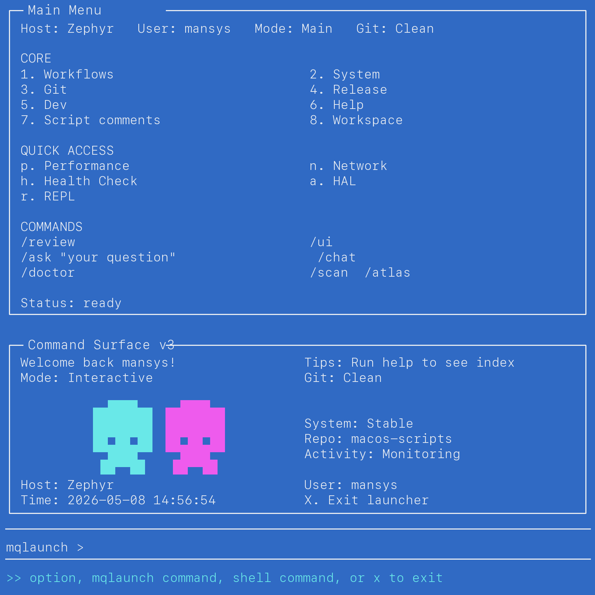
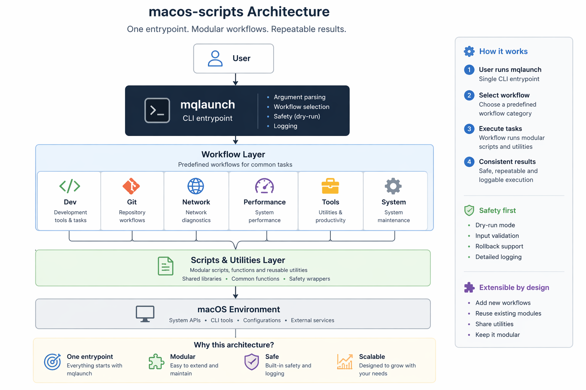

# 👋 Hi, I'm Mattias Camner

I design and build real-world infrastructure systems — where **security, usability, and operations actually work together**.

Focused on **EUC, Zero Trust, endpoint platforms, and automation in complex environments**.

---

## 💡 TL;DR

I build systems that reduce operational friction, improve security without breaking usability, and turn scattered tools into structured workflows.

```text
useful chaos → usable systems
```

---

## 🚀 Featured: macos-scripts

A practical macOS toolkit built around automation, workflows, and terminal-driven operations.

<p align="center">
  
  
  
  
</p>

<p align="center">
  
</p>

At the core is:

> **mqlaunch** — a modular command surface that turns scattered terminal workflows into one structured system.

```text
one command → structured workflows → repeatable execution
```

Repo: https://github.com/MCamner/macos-scripts  
Site: https://mcamner.github.io/macos-scripts/

---

## 🧩 Architecture

<p align="center">
  
</p>

- `mqlaunch` is the single entrypoint
- workflows provide structured execution
- scripts stay modular underneath
- the system remains extensible without becoming chaotic

---

## 🧪 Design-Prototype

Browser-based prototypes for client readiness, endpoint visibility, macOS compliance, fleet views, certificate expiry risk, and enterprise validation workflows.

Includes:

- Client Readiness Dashboard
- Fleet Command Center
- macOS Enterprise Dashboard
- Certificate Expiry Timeline
- MQ Mirror
- MQ Client Optimizer

Repo: https://github.com/MCamner/Design-Prototype  
Site: https://mcamner.github.io/Design-Prototype/

---

## 🪞 MQ Mirror

MQ Mirror translates macOS GUI actions into terminal command equivalents — helping operators learn, document, and execute faster.

```bash
tools/mqmirror/mqmirror network
tools/mqmirror/mqmirror inspect
tools/mqmirror/mqmirror watch --interval 1 --compact --ignore-terminal
```

```text
GUI action → CLI equivalent → better operational understanding
```

Part of: https://github.com/MCamner/Design-Prototype/tree/main/tools/mqmirror

---

## 🔍 MQ Client Optimizer

MQ Client Optimizer evaluates IGEL OS 12 and macOS clients against structured baselines — covering Citrix readiness, certificate health, and CIS-style security compliance.

```bash
python3 tools/mq-client-optimizer/mq_client_optimizer.py list-baselines
python3 tools/mq-client-optimizer/mq_client_optimizer.py analyze \
  --baseline macos-enterprise-cis-lite --sample
python3 tools/mq-client-optimizer/mq_client_optimizer.py serve
```

```text
client data → baseline evaluation → scored report
```

Part of: https://github.com/MCamner/Design-Prototype/tree/main/tools/mq-client-optimizer

---

## 🧠 What I Actually Do

I work at the intersection of:

- 🏗️ Endpoint & Infrastructure Architecture
- 🔐 Security, Identity & Zero Trust
- ⚙️ Automation & System Integration
- 🧪 Client Readiness & Validation
- 🧭 Systems Thinking

My focus is simple:

> Turn complex environments into systems that are usable, secure, and operationally realistic.

---

## 📌 Case Thinking

### macos-scripts

**Problem:** scattered shell scripts, low discoverability, inconsistent execution  
**Solution:** one modular command surface with structured workflows  
**Outcome:** repeatable execution and reduced operational friction

### Client Readiness / Endpoint Validation

**Problem:** enterprise clients often fail because readiness is assumed, not verified  
**Solution:** browser-based and helper-assisted validation of endpoint signals  
**Outcome:** practical visibility into whether a client is actually ready for enterprise workflows

---

## 🛠️ Tech & Tools

**Endpoint & EUC:** Citrix, IGEL OS, Intune, SCCM  
**Infrastructure:** Active Directory, VMware, Windows, Linux  
**Security:** Zero Trust, certificates, identity, access patterns  
**Automation:** Python, Bash, Zsh, CLI workflows  
**Architecture:** client readiness, validation, structured systems

---

## 📊 GitHub Philosophy

I use GitHub as a working system, not just a portfolio.

```text
real problems → real constraints → practical prototypes
```

---

## 🧭 How I Work

- Reduce complexity — don’t add layers
- Build for real operations, not slides
- Balance security with usability
- Make workflows discoverable and repeatable

---

## 🌐 Connect

- Website: https://mcamner.com
- LinkedIn: https://www.linkedin.com/in/mattias-camner-75958022
- Art platform: https://blackiris.se

---

## 🧩 Motto

> Build things that work. Then make them impossible to break.
