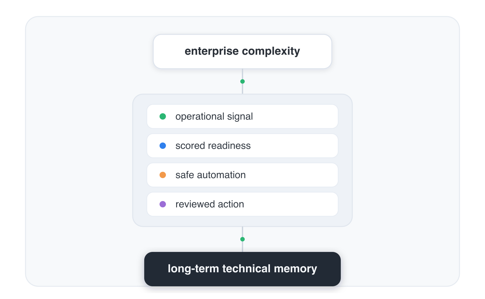

# Mattias Camner

### Infrastructure / Endpoint / Automation Architect

**Endpoint readiness · Repo intelligence · Governed AI operations**

I build a local AI operating system for infrastructure, endpoint readiness, repo intelligence, and safe automation.

[Client tools](https://mcamner.github.io/MCamner/) ·
[Journal](https://mcamner.github.io/mcamner-journal/) ·
[LinkedIn](https://www.linkedin.com/in/mattias-camner-75958022) ·
[Black Iris](https://blackiris.se/)

## What I build

The MQ stack connects local repositories, endpoint operations, and AI-assisted engineering through one practical loop:

<pre>
endpoint / repo / workflow
→ signal
→ score
→ gate
→ memory
→ better next action
</pre>

The focus is operational: make state visible, decisions explainable, and automation safe enough to use under real pressure.

## MQ ecosystem

| Repository | Role |
|---|---|
| [`macos-scripts`](https://github.com/MCamner/macos-scripts) | Terminal entrypoint and local workflow toolkit |
| [`mq-agent`](https://github.com/MCamner/mq-agent) | Orchestrates sweeps, reviews, release gates, and alerts |
| [`mq-mcp`](https://github.com/MCamner/mq-mcp) | Policy-bound MCP runtime for controlled tool execution |
| [`repo-signal`](https://github.com/MCamner/repo-signal) | Scores repo readiness and exports structured AI context |
| [`mq-image-analyze`](https://github.com/MCamner/mq-image-analyze) | Extracts operational signal from screenshots and UI states |
| [`mq-ums`](https://github.com/MCamner/mq-ums) | Provides a gated operator surface for IGEL UMS workflows |

[Explore the full MQ ecosystem](docs/MQ_ECOSYSTEM.md)

## Operating model

One entrypoint, layered workflows, reviewable actions.

The model favors signal before action, local execution, explicit policy gates, and reusable technical memory. [Read the operating model](docs/OPERATING_MODEL.md).

## Selected repos

- **[`macos-scripts`](https://github.com/MCamner/macos-scripts)** — the terminal front door for MQ workflows, diagnostics, and stack control.
- **[`mq-agent`](https://github.com/MCamner/mq-agent)** — coordinates repo intelligence and operational workflows without hiding what happens.
- **[`mq-mcp`](https://github.com/MCamner/mq-mcp)** — makes AI tool use predictable through contracts, policy gates, and explicit boundaries.
- **[`repo-signal`](https://github.com/MCamner/repo-signal)** — turns repository state into readiness scores, release checks, and agent context.

[More project notes](docs/PROJECTS.md) · [Security and public-data policy](docs/SECURITY.md)

## Connect

- [Client readiness tools](https://mcamner.github.io/MCamner/)
- [Technical journal](https://mcamner.github.io/mcamner-journal/)
- [LinkedIn](https://www.linkedin.com/in/mattias-camner-75958022)
- [Black Iris](https://blackiris.se/)
