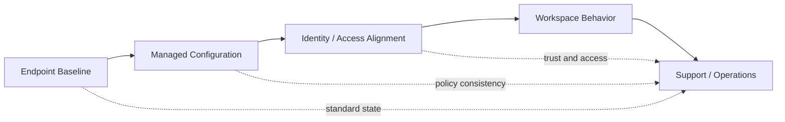

# Case: endpoint-standardization

## Summary

Endpoint complexity has a habit of growing quietly. Different device states, different client behaviors, different local exceptions, and different support paths all add friction long before anyone describes the environment as "too complex."

This case describes how I think about endpoint standardization: not as standardization for its own sake, but as a way to reduce hidden variation, improve supportability, and create a more trustworthy operating model.

This is a representative case based on the types of design problems I work with, rather than a client-specific write-up.

---

## Starting Point

Many endpoint environments drift into the same pattern:

* devices behave differently across teams, users, or use cases
* support quality depends too much on who picks up the issue
* configuration variance creates instability and unclear ownership
* security and usability decisions are applied unevenly
* operational workarounds slowly become part of the system

The result is usually not one dramatic failure. It is an accumulation of inconsistency that makes the environment harder to trust and harder to operate.

---

## Before -> After

Before:

* endpoint behavior varied too much between similar scenarios
* support effort increased because "normal" was hard to define
* exceptions multiplied faster than standards
* architecture decisions were diluted by unmanaged local variation

After:

* endpoint states are easier to define and reason about
* support becomes more predictable because baselines are clearer
* security and usability controls can be applied more consistently
* the platform becomes easier to evolve because variation is better contained

---

## Goal

Create a more standardized endpoint model that improves:

* consistency
* supportability
* operational clarity
* security alignment
* user predictability

The point is not to remove every exception. The point is to keep the environment understandable enough to manage with confidence.

---

## Typical Constraints

The environments I work with often include constraints such as:

* existing endpoint diversity across hardware, roles, or access patterns
* dependencies on Citrix, IGEL, or managed workspace models
* identity and authentication requirements that affect device behavior
* operational pressure to preserve business continuity during change
* legacy decisions that cannot be replaced in one step
* multiple teams sharing responsibility across endpoint, security, and infrastructure

This means standardization has to be designed as an operating model, not just a technical baseline.

---

## Approach

My approach is to standardize around behavior, ownership, and supported states rather than trying to standardize every implementation detail at once.

That usually means:

* defining a smaller number of supported endpoint patterns
* clarifying what "healthy" and "managed" actually mean
* reducing unnecessary configuration variation
* aligning endpoint design with identity and workspace access flows
* making support expectations explicit instead of assumed

The goal is to make endpoint behavior more predictable for both users and operations teams.

### Example model

The important part is not the diagram itself. It is the principle: endpoint, identity, workspace, and support should reinforce the same operating model.

---

## Design Tradeoffs

Endpoint standardization is never just "more standardization is better."

The real tradeoffs usually are:

* consistency versus flexibility
* control versus local autonomy
* faster support versus broader customization
* cleaner baselines versus the cost of transition

Good design accepts those tradeoffs openly and chooses where standardization creates the most operational value.

---

## Why This Matters

A standardized endpoint model creates value in ways that are easy to underestimate:

* troubleshooting gets faster because expected states are clearer
* security controls become easier to apply consistently
* architecture decisions stay intact longer because local variation is reduced
* users get a more predictable experience across similar scenarios

That matters because endpoint inconsistency often shows up as operational drag long before it is recognized as an architecture problem.

---

## Outcome

The outcome I aim for is an endpoint model that is:

* easier to explain
* easier to support
* easier to secure
* easier to scale
* easier to improve incrementally

Even in complex environments, a stronger baseline creates more room for safe change.

---

## What It Demonstrates

This case reflects how I think about systems design more broadly:

* reduce ambiguity before adding more control
* standardize where it improves clarity and trust
* design with supportability in mind from the start
* treat operational consistency as part of architecture quality

That is the same mindset behind my work in digital workplace architecture, identity flows, and practical automation.

---

## Likely Next Layers

Natural extensions of this case would be:

* a deeper write-up on baseline design and supported states
* a case focused on operational governance for endpoint changes
* a companion diagram showing exception handling and escalation paths
