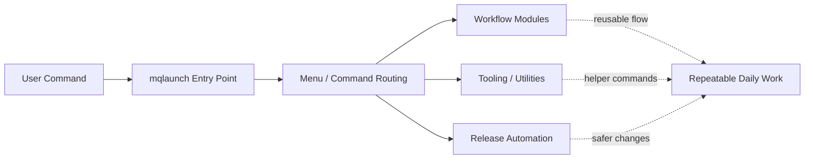

# Case: macos-scripts

## Summary

`macos-scripts` started as a growing set of useful shell utilities for macOS workflows. The challenge was not writing individual scripts. The challenge was making the toolset usable, discoverable, maintainable, and safe to evolve.

The result was a more structured command system centered around `mqlaunch`: a modular CLI surface that turns scattered scripts into a coherent workflow tool.

Repository:
https://github.com/MCamner/macos-scripts

---

## Starting Point

The project had useful building blocks, but the experience carried the same risks many script collections do:

* tools were easy to add but harder to navigate over time
* workflows depended too much on memory
* related capabilities were spread across different files and entrypoints
* growth risked turning the repo into a pile of scripts instead of a system

The core problem was not lack of functionality. It was lack of structure around the functionality.

---

## Before -> After

Before:

* useful scripts existed, but discovery depended too much on memory
* related tasks were spread across multiple entrypoints and folders
* growth risked turning the repo into a script dump rather than a coherent tool
* repeatable operational flows were harder to maintain safely

After:

* `mqlaunch` provides one visible command surface for the system
* workflows are grouped into clearer modules and menu paths
* release handling is safer through dry-run and rollback support
* the repo is easier to extend without collapsing into one monolithic shell file

---

## Goal

Create a command surface that makes terminal workflows:

* easier to find
* easier to use repeatedly
* easier to extend safely
* easier to treat as a product instead of a script dump

---

## Constraints

The design had to work within practical boundaries:

* shell-first environment on macOS
* existing utilities already in use
* low-friction daily operation
* incremental improvement rather than a destructive rewrite
* room for compatibility where older paths still mattered

---

## Approach

The project was re-centered around `mqlaunch` as the main entrypoint.

Key design choices:

* one visible command surface instead of many loosely related commands
* modular menus so interactive flows could be separated cleanly
* grouped capabilities around real tasks such as performance, workflows, tools, login, and release handling
* release automation with dry-run and rollback to reduce manual risk
* compatibility bridges where needed, instead of forcing a hard cutover

This moved the repo from "collection of scripts" toward "operational command system".

### Example flow

The point is not just to add menus. It is to give many small utilities a stable product surface so the toolkit stays usable as it grows.

---

## Why This Design

This approach solves several common problems at once:

* discoverability improves because users do not need to remember where everything lives
* maintenance improves because related flows are organized behind stable entrypoints
* extensibility improves because new capabilities can fit into an existing structure
* usability improves because workflows feel intentional instead of accidental

In other words: the value comes less from any single script and more from how the system is shaped.

---

## Outcome

The project now presents as a more coherent CLI product with:

* a central launcher for recurring terminal tasks
* clearer workflow navigation
* modular architecture that is easier to evolve
* safer release handling
* a stronger foundation for future expansion

It also became a better portfolio project because the structure now reflects the way I prefer to work: taking fragmented, useful pieces and turning them into systems people can actually operate.

---

## What It Demonstrates

This case reflects how I think about technical work in general:

* usability and structure matter as much as raw functionality
* operational safety should be built into workflows
* small tools become more valuable when they are composed intentionally
* good systems reduce both friction and hidden complexity

That mindset carries across infrastructure, endpoint design, automation, and secure digital workplace work.

---

## Next Evolution

Natural next steps for the project include:

* deeper release workflow integration
* plugin-style extension patterns
* continued cleanup of legacy compatibility paths
* stronger validation and quality checks around changes
