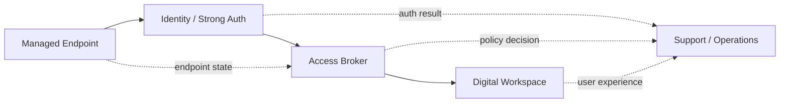

# Case: secure-workplace

## Summary

Secure digital workplace design is rarely limited by technology alone. The real difficulty is making identity, endpoint controls, access methods, user experience, and support models work together without creating unnecessary friction.

This case describes the kind of architecture work I enjoy most: shaping secure workplace access so it is strong enough to trust, but still practical enough to operate in day-to-day reality.

This is a representative architecture case rather than a client-specific write-up. It reflects the patterns, tradeoffs, and design thinking I apply in real delivery work.

---

## Starting Point

Many workplace environments develop the same tension over time:

* security requirements increase
* authentication flows become more complex
* endpoint variations create inconsistency
* support teams inherit fragile process chains
* end users experience the solution as confusing or unreliable

On paper, each control can look reasonable. In practice, the combined experience can become difficult to operate, difficult to support, and difficult to trust.

---

## Before -> After

Before:

* access depended on multiple layers that were not always experienced as one coherent system
* endpoint variation created instability and inconsistent user journeys
* support effort increased because failure points crossed team and technology boundaries
* security controls added friction when they were not matched with clear operational flows

After:

* the workplace is treated as a connected access system rather than a collection of isolated components
* endpoint, identity, and access behavior are aligned more deliberately
* supportability improves because failure domains are clearer
* security becomes easier to enforce consistently because the operating model is more explicit

---

## Goal

Design a digital workplace model that balances:

* secure authentication
* predictable endpoint behavior
* clear access flows
* supportable operations
* usable day-to-day experience for real users

The target is not just stronger security. The target is a secure system people can actually work through.

---

## Typical Constraints

The environments I work in usually include some combination of:

* Citrix or similar virtualized workspace patterns
* IGEL or tightly managed endpoint models
* identity dependencies across Active Directory and related services
* smartcard, SafeNet, or other strong-auth requirements
* multiple stakeholders with different priorities across security, operations, and user experience
* legacy decisions that cannot be replaced all at once

This means architecture work has to improve the system incrementally, not pretend complexity can simply be removed overnight.

---

## Approach

My approach is to design around flows, responsibilities, and failure points rather than only around components.

Key design principles:

* make the authentication path explicit from endpoint to identity to workspace access
* reduce variation where standardization creates stability
* separate what must be secure from what must be flexible
* account for support and troubleshooting as part of the design, not as an afterthought
* treat usability as a control amplifier rather than as a compromise

In practical terms, that usually means clarifying the chain between device state, user state, authentication method, access broker, and resulting workspace behavior.

### Example flow

The specific platforms can change, but the important part is the model: endpoint state, identity, access control, and user experience need to be designed as one operational chain.

---

## Design Focus Areas

### Identity and Authentication

Authentication should be strong, but also predictable.

That means designing flows where:

* the expected method is clear
* failure states are understandable
* token, certificate, or smartcard dependencies do not create hidden fragility
* the user journey aligns with the security model instead of fighting it

### Endpoint Standardization

A secure workplace becomes easier to trust when endpoints behave consistently.

That usually involves:

* reducing unnecessary client variation
* tightening baseline configuration
* aligning endpoint behavior with the access pattern
* ensuring managed states are visible and supportable

### Operational Supportability

A design is incomplete if the support path is weak.

This is why I put weight on:

* understandable failure domains
* clearer ownership boundaries
* fewer ambiguous handoffs between teams
* workflows that make troubleshooting faster and less fragile

---

## Design Tradeoffs

Secure workplace design is full of tradeoffs, and pretending otherwise usually creates brittle solutions.

The balance I look for is:

* strong controls without hiding the user journey behind avoidable complexity
* standardization where it reduces risk, but not where it blocks necessary flexibility
* security models that remain supportable under real operational pressure
* incremental improvement instead of large redesigns that ignore existing dependencies

---

## Why This Matters

The point of secure workplace architecture is not to assemble enough controls to satisfy a diagram. It is to produce an environment where security, usability, and operability reinforce each other.

When those elements are aligned well, the result is:

* lower friction for users
* more predictable support outcomes
* clearer trust boundaries
* less hidden complexity in daily operations

That is usually where the real value appears.

---

## Outcome

The outcome I aim for in this kind of work is a workplace model that is:

* easier to explain
* easier to operate
* easier to support
* easier to secure consistently
* easier to evolve without destabilizing core access patterns

Even when the environment remains complex, the design can still become clearer, more stable, and more trustworthy.

---

## What It Demonstrates

This case reflects how I work across infrastructure and security architecture:

* I design around real operational conditions, not idealized diagrams
* I treat user experience and supportability as architecture concerns
* I prefer standardization where it reduces risk and ambiguity
* I focus on end-to-end system behavior, not isolated technical components

That is the same mindset behind my work in digital workplace architecture, identity flows, endpoint management, and practical automation.

---

## Likely Next Layers

Natural extensions of this case would be:

* a deeper identity-flow case focused on strong authentication patterns
* an endpoint-standardization case centered on consistency and maintainability
* supporting diagrams or flow maps to make the architecture even easier to review
